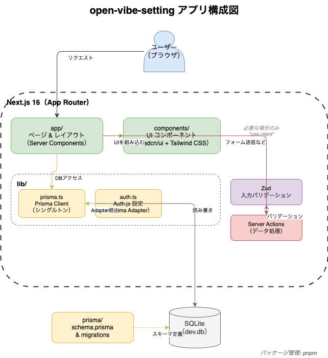

# open-vibe-setting

`open-vibe-setting` は、Next.js + Prisma + SQLite をベースにしたアプリ開発用の設定リポジトリです。

このリポジトリには、**この構成でAI駆動開発を進めるための最低限の設定**を記載しています。

## はじめて読む方向け（まずここだけ）

1. この README の「現在の構成」を読む
2. どのファイルが何のためにあるかを把握する
3. 必要なファイルを追加しながら開発を進める

> このリポジトリは「最小スタート」前提です。  
> 最初はファイルが少ない状態ですが、AI と対話しながら段階的に増やしていく想定です。

## 現在の構成

- `.github/copilot-instructions.md`  
  AI に「このプロジェクトの作法」を伝えるためのガイドラインです。

## 用語ミニガイド

- **AI駆動開発**: AI に相談しながら、コード作成・修正を進める開発スタイル
- **Prisma**: データベースを TypeScript から扱いやすくするツール
- **SQLite**: ファイル1つで使える軽量データベース
- **環境変数**: コードに直接書かない設定値（秘密情報を含む）

## 想定技術スタック

- Next.js 16（App Router）
- TypeScript
- Prisma ORM 7 + SQLite
- shadcn/ui + Tailwind CSS
- Auth.js（NextAuth v5）
- Zod
- pnpm

## 開発ガイド（方針）

- デフォルトは Server Components を使用
- DB アクセスは Server Components / Server Actions からのみ実施
- Prisma Client はシングルトンで管理
- ユーザー入力は Zod でバリデーション
- UI は shadcn/ui を優先

## メモ

まだアプリ本体のコード（`app/` や `components/` など）は未配置のため、
必要に応じてこの README を更新してください。

## アーキテクチャ

